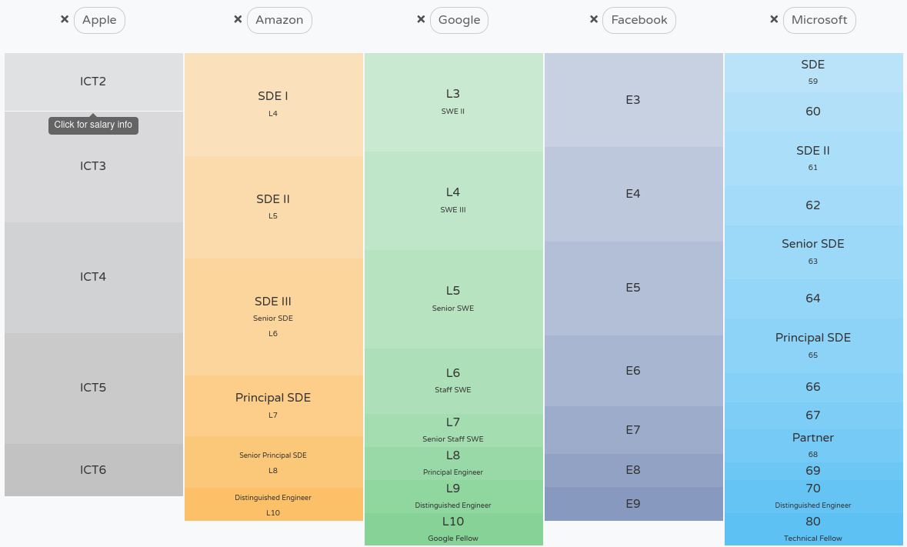
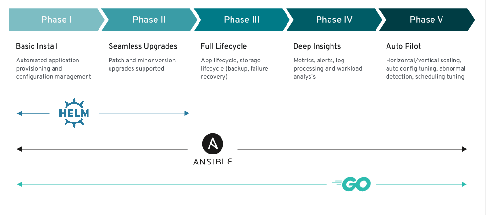

# To Become Masterful → 2BM

> Worst recruiters look for fullstack profiles or some other magic word like senior,  semi-senior, etc. The issue with recruiters is that get profits for quantities not for quality. A rasonable list of job titles include:

* * cloud architect

> In the major technology organizations the technicians are the most important asset!. They know that and create a way to keep this talent growing into the organization

[So, how big companies growing up the skills of their technicians?](https://www.levels.fyi/?compare=Apple,Amazon,Google,Facebook,Microsoft&track=Software%20Engineer#)

* Apple ·········· **ICT** ······ individual contributor technical
* Amazon ······ **SDE** ····· software development engineer
* Microsoft ···· **SDE** ····· software development engineer
* Facebook ···· **E** ·········· engineer
* Google ········· **SWE**  ··· software engineer lever X

## [VASS](http://canalempleo.vass.es/planes-de-carrera)

> “sólo vivimos los días que amamos y hacemos el bien a otros, y eso es lo que nos hace estar vivos siempre en los demás y no morir nunca”.
>
> ... bendiciones ...

